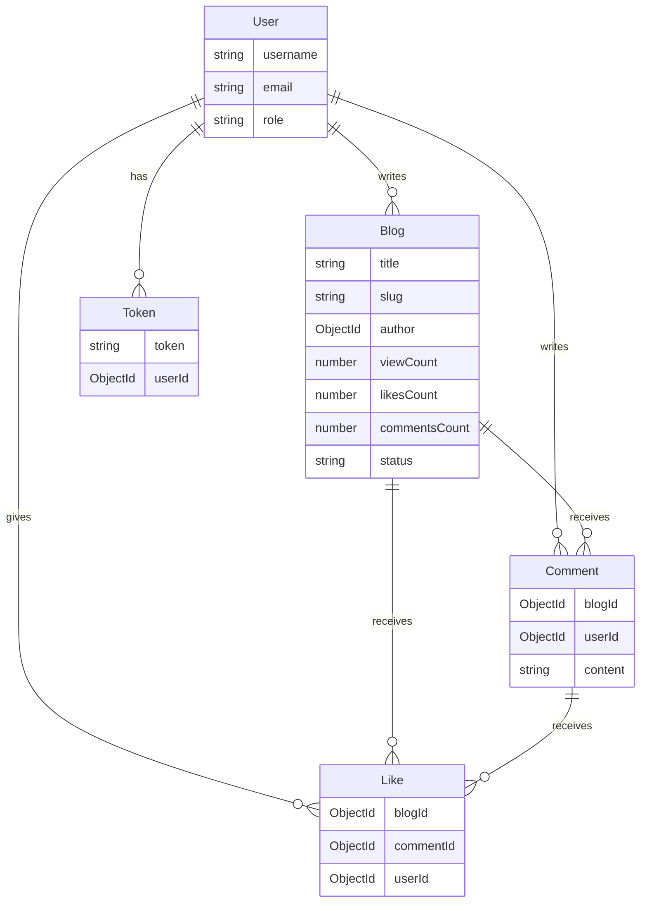
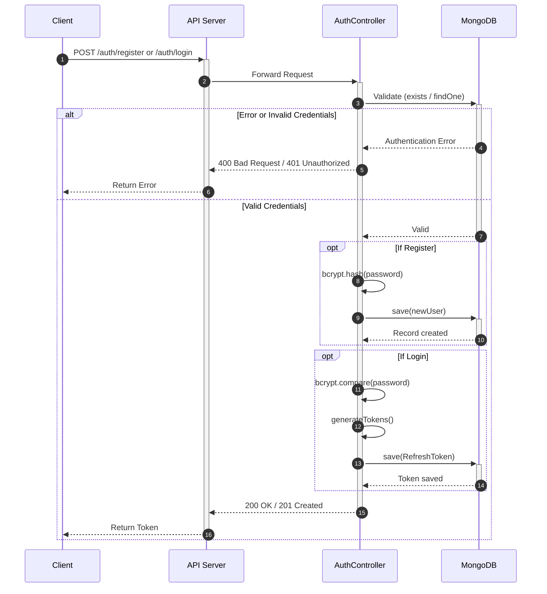
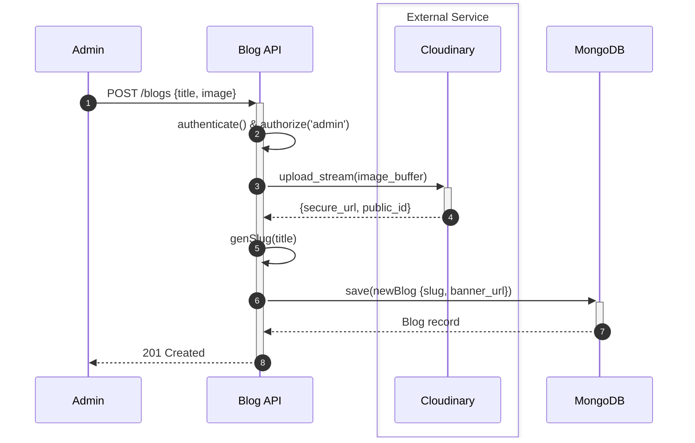
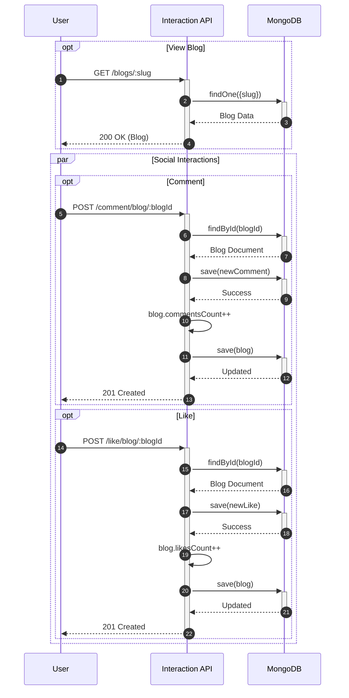
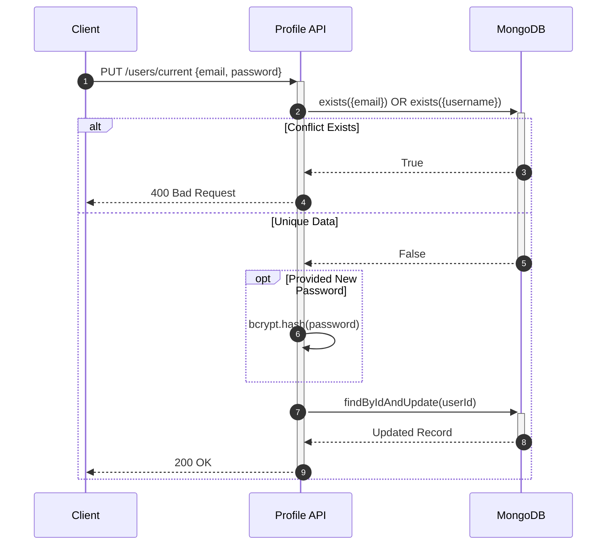
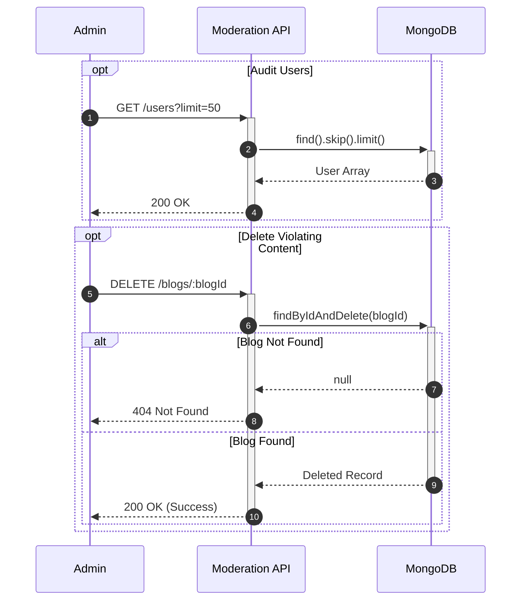

<p align="center">
  
</p>

<h1 align="center">🚀 Blog API - Week 1</h1>

<p align="center">
  <strong>A robust and scalable RESTful API for a Blog platform. Built with TypeScript, Express, and MongoDB (Mongoose).</strong>
</p>
<p align="center">
  <em>This project is a backend service for a blog application, featuring authentication, role-based access control (Admin & User), article management, and social interactions (comments & likes). It acts as a foundational template, demonstrating the use of robust architectural patterns and modern Node.js/TypeScript practices.</em>
</p>

<p align="center">
  <a href="https://nodejs.org/"></a>
  <a href="https://expressjs.com/"></a>
  <a href="https://www.typescriptlang.org/"></a>
  <a href="https://www.mongodb.com/"></a>
  <a href="https://jwt.io/"></a>
  <a href="LICENSE"></a>
</p>

## ✨ Key Features

- **Authentication & Security**
  - Secure JSON Web Tokens (JWT) implementation (access and refresh tokens) & bcrypt password hashing.
  - Role-Based Access Control (RBAC) separating Admin and normal User functionalities.
  - Security suite: `Helmet`, `CORS`, `Express-Rate-Limit`, and API request payload validation via `express-validator`.
- **Blog Lifecycle Management**
  - Full CRUD operations supporting rich text and slugs.
  - Centralized image and media processing with Multer & Cloudinary integration.
- **Social Interactions**
  - Robust commenting and like system directly tied to users and blog posts.
- **Scalable Architecture**
  - Neatly structured MVC-style folder logic (`router`, `controller`, `services`, `middleware`).
  - Strict typing logic using custom `@types` definitions for robust code execution.

## 🛠️ Tech Stack & Key Libraries

- **Runtime & Framework**: Node.js, Express.js
- **Language**: TypeScript
- **Database**: MongoDB & Mongoose
- **File Uploads**: Multer & Cloudinary
- **Logging**: Winston & Morgan

## 📂 Project Structure

```text
src/
├── @types/       # Custom TypeScript type definitions
├── config/       # App configuration (Environment variables, constants)
├── controller/   # API request handlers
├── lib/          # Third-party library setup (e.g., Mongoose, Winston)
├── middleware/   # Custom Express middlewares (Auth, Validation, Uploads)
├── model/        # Mongoose schemas & models
├── router/       # API route definitions
├── services/     # Core business logic
├── utils/        # Utility functions
└── server.ts     # Main server entry point
```

## 📊 Entity Relationship Diagram (ERD)

<details>
<summary><b>🧩 Click to expand the Entity-Relationship Diagram (ERD)</b></summary>



</details>

## 🔄 Sequence Diagrams (Flows)

<details>
<summary><b>🧩 Click to expand 5 Core Architecture Sequence Diagrams</b></summary>

### 1. Unified Authentication Architecture


### 2. Content Publishing & Media Architecture


### 3. User Engagement Lifecycle


### 4. User Profile Updating


### 5. Admin Moderation Architecture


</details>

## ⚙️ Installation & Usage

1. **Clone the repository**

   ```bash
   git clone https://github.com/MT-KS-04/Blog-API-Week1.git
   cd Blog-API-Week1
   ```

2. **Install dependencies**

   ```bash
   npm install
   ```

3. **Configure Environment Variables**
   Create a `.env` file in the root directory. Feel free to adjust values according to your configuration.

   ```env
   MONGOOSE_URL=mongodb+srv://<username>:<password>@cluster0.mongodb.net/?retryWrites=true&w=majority
   PORT=3000
   NODE_ENV=development
   # Add other required variables (JWT secrets, Cloudinary keys, etc.)
   ```

   > ⚠️ **Note:** Do not commit your `.env` file, as it contains sensitive information.

4. **Run the Project (Development mode with hot-reload)**
   ```bash
   npm start
   ```

## 📡 API Reference

Base path for all API endpoints is: `/api/v1`

### 🩺 System

| Method | Endpoint | Description                    | Access |
| :----- | :------- | :----------------------------- | :----- |
| `GET`  | `/`      | API Healthcheck & general info | Public |

### 🔐 Authentication (`/auth`)

| Method | Endpoint              | Description                                     | Access        |
| :----- | :-------------------- | :---------------------------------------------- | :------------ |
| `POST` | `/auth/register`      | Register a new user account                     | Public        |
| `POST` | `/auth/login`         | Log into an existing account                    | Public        |
| `POST` | `/auth/refresh-token` | Obtain a new access token using a refresh token | Public        |
| `POST` | `/auth/logout`        | Log out and invalidate sessions                 | Authenticated |

### 🧑‍💻 Users (`/users`)

| Method   | Endpoint         | Description                          | Access       |
| :------- | :--------------- | :----------------------------------- | :----------- |
| `GET`    | `/users/current` | Retrieve current user profile        | Admin / User |
| `PUT`    | `/users/current` | Update current user profile details  | Admin / User |
| `DELETE` | `/users/current` | Delete current user account          | Admin / User |
| `GET`    | `/users`         | Retrieve a list of all users         | Admin Only   |
| `GET`    | `/users/:userId` | Retrieve a specific user by their ID | Admin Only   |
| `DELETE` | `/users/:userId` | Delete a specific user by their ID   | Admin Only   |

### 📝 Blogs (`/blogs`)

| Method   | Endpoint              | Description                                | Access       |
| :------- | :-------------------- | :----------------------------------------- | :----------- |
| `POST`   | `/blogs`              | Create a new blog post                     | Admin Only   |
| `GET`    | `/blogs`              | Retrieve a list of all blog posts          | Admin Only   |
| `GET`    | `/blogs/user/:userId` | Retrieve all blog posts by a specific user | Admin Only   |
| `GET`    | `/blogs/:slug`        | Retrieve a blog post by its URL slug       | Admin / User |
| `PUT`    | `/blogs/:blogId`      | Update an existing blog post               | Admin Only   |
| `DELETE` | `/blogs/:blogId`      | Delete a blog post                         | Admin Only   |

### 💬 Comments (`/comment`)

| Method   | Endpoint                   | Description                                 | Access       |
| :------- | :------------------------- | :------------------------------------------ | :----------- |
| `POST`   | `/comment/blog/:blogId`    | Add a comment to a specific blog post       | Admin / User |
| `GET`    | `/comment/blog/:blogId`    | Get all comments under a specific blog post | Admin / User |
| `DELETE` | `/comment/blog/:commentId` | Delete a specific comment                   | Admin / User |

### ❤️ Likes (`/likes`)

| Method   | Endpoint              | Description                         | Access       |
| :------- | :-------------------- | :---------------------------------- | :----------- |
| `POST`   | `/likes/blog/:blogId` | Like a specific blog post           | Admin / User |
| `DELETE` | `/likes/blog/:blogId` | Unlike a previously liked blog post | Admin / User |

## 👥 Author & Contact

This project is conceptualized and implemented by **KTOMIS**. If you want to contribute, discuss, or request documents, feel free to reach out via the following channels 👇

- **KTOMIS**
  - 📧 Email: [ktomis2004@gmail.com](mailto:ktomis2004@gmail.com)
  - 🐙 GitHub: [@MT-KS-04](https://github.com/MT-KS-04)
  - 💼 LinkedIn: [KTOMIS](https://www.linkedin.com/in/mis-k-to-4a64b8345/)

## 📜 License

This project is distributed under the **Apache License 2.0**. See the `LICENSE` file for more details regarding terms, rights, and limitations.

---

<p align="center">
  <b>© 2026 KTOMIS. All rights reserved.</b><br/>
  <em>A robust and scalable RESTful API for a Blog platform. Built with TypeScript, Express, and MongoDB (Mongoose).</em>
</p>
