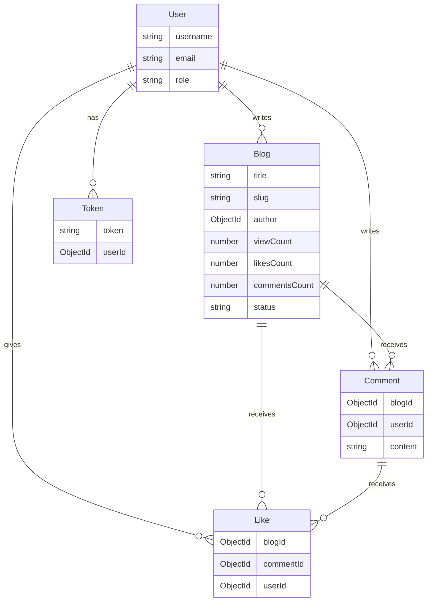
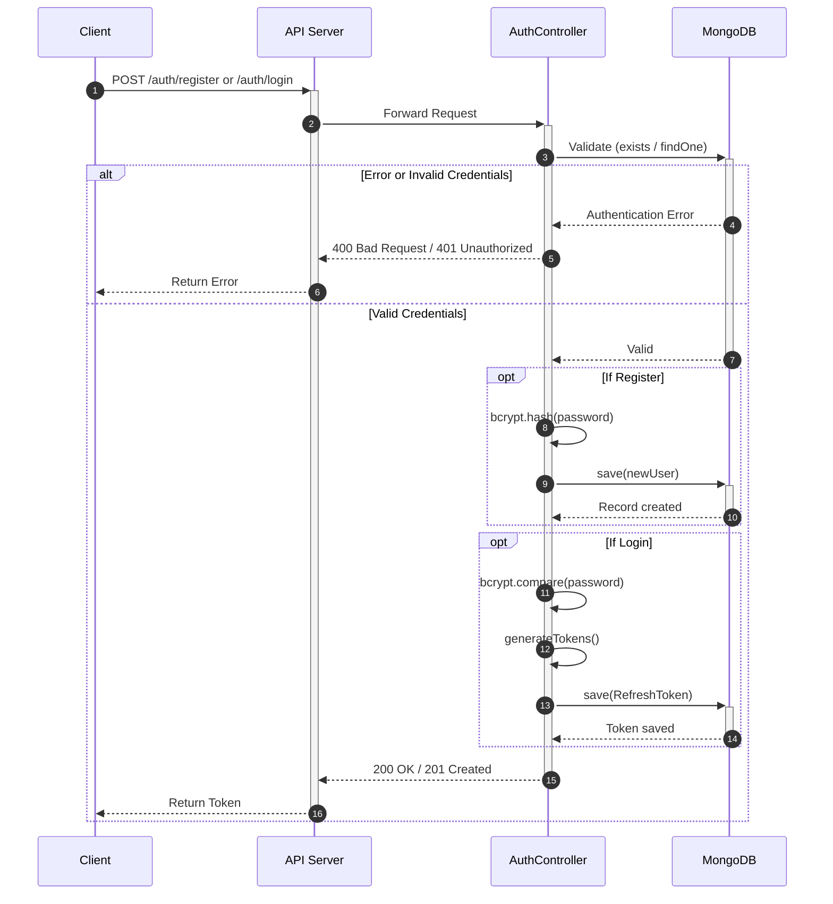
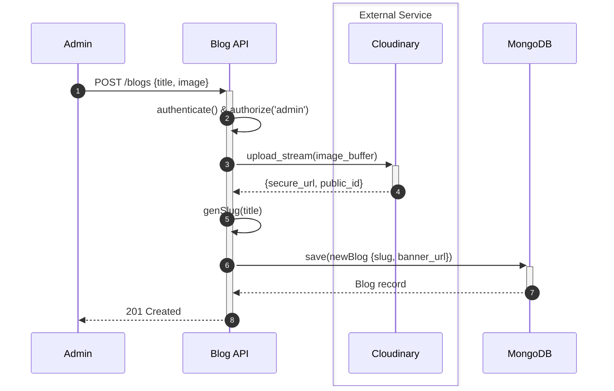
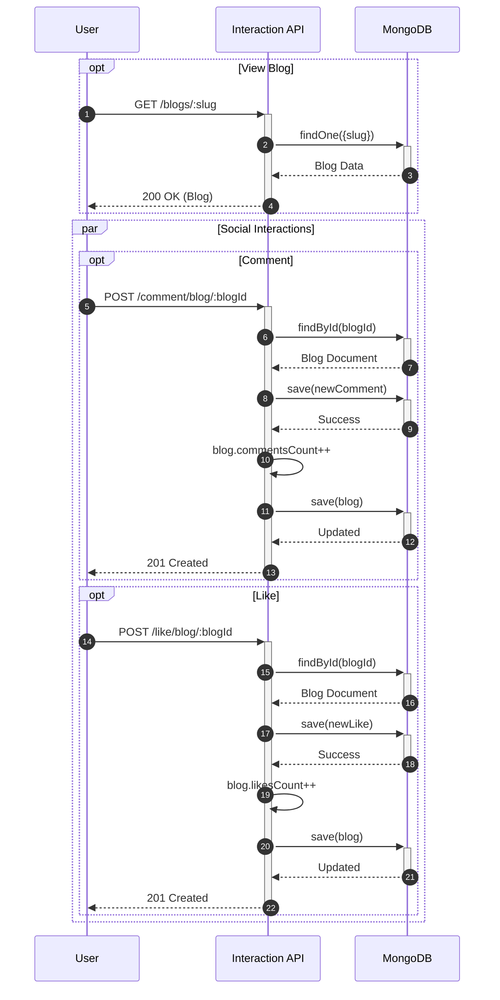
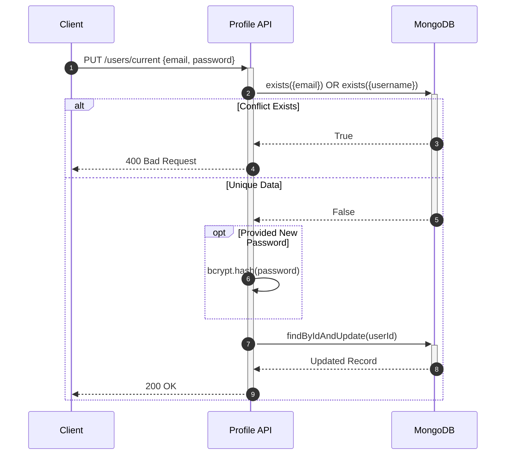
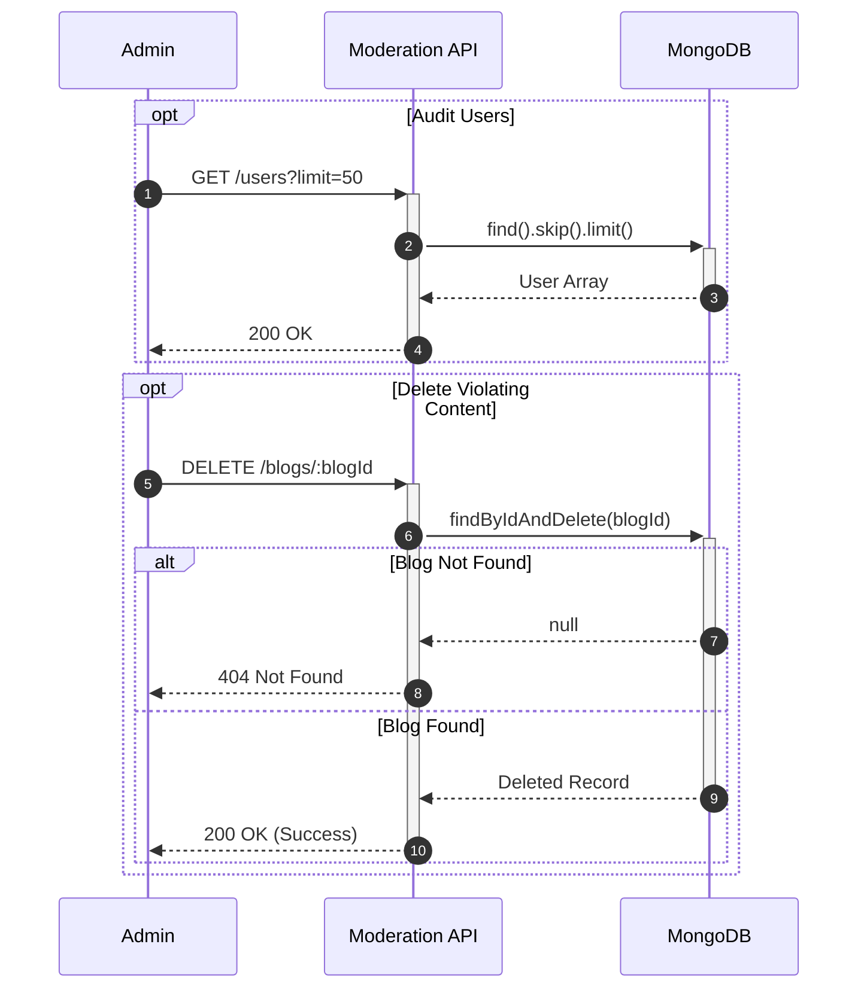

<p align="center">
  
</p>

<h1 align="center">🚀 Blog API - Week 1</h1>

<p align="center">
  <strong>A robust and scalable RESTful API for a Blog platform. Built with TypeScript, Express, and MongoDB (Mongoose).</strong>
</p>
<p align="center">
  <em>This project is a backend service for a blog application, featuring authentication, role-based access control (Admin & User), article management, and social interactions (comments & likes). It acts as a foundational template, demonstrating the use of robust architectural patterns and modern Node.js/TypeScript practices.</em>
</p>

<p align="center">
  <a href="https://nodejs.org/"></a>
  <a href="https://expressjs.com/"></a>
  <a href="https://www.typescriptlang.org/"></a>
  <a href="https://www.mongodb.com/"></a>
  <a href="https://jwt.io/"></a>
  <a href="LICENSE"></a>
</p>

## ✨ Key Features

- **Authentication & Security**
  - Secure JSON Web Tokens (JWT) implementation (access and refresh tokens) & bcrypt password hashing.
  - Role-Based Access Control (RBAC) separating Admin and normal User functionalities.
  - Security suite: `Helmet`, `CORS`, `Express-Rate-Limit`, and API request payload validation via `express-validator`.
- **Blog Lifecycle Management**
  - Full CRUD operations supporting rich text and slugs.
  - Centralized image and media processing with Multer & Cloudinary integration.
- **Database connectivity**
  - **MongoDB Atlas** (default): Mongoose connects with Stable API (`serverApi` v1) options from `src/lib/mongoose.ts`.
  - **Amazon DocumentDB** (optional): set `USE_DOCUMENTDB=true` for TLS + CA file and driver options compatible with DocumentDB (no Stable API).
- **Social Interactions**
  - Robust commenting and like system directly tied to users and blog posts.
- **Scalable Architecture**
  - Layered layout: `router` → `middleware` → `controller` → `model` / `lib` (business logic lives mainly in controllers and shared libs).
  - Strict typing with custom `@types` (e.g. augmented Express request).
- **API documentation**
  - OpenAPI spec generated from JSDoc (`swagger-jsdoc`) and served with **Swagger UI** at `/api-docs` (after `npm run generate:openapi` or `npm run build`).
- **Content safety**
  - Blog HTML is sanitized with **DOMPurify** (via `jsdom`) before persistence.

## 🛠️ Tech Stack & Key Libraries

- **Runtime & Framework**: Node.js, Express.js 5
- **Language**: TypeScript
- **Database**: MongoDB & Mongoose
- **File uploads & media**: Multer, Cloudinary
- **Auth**: JWT (access token in `Authorization` header), refresh token in **httpOnly** cookie, bcrypt
- **HTTP**: Helmet, CORS, compression, cookie-parser, express-rate-limit, express-validator
- **Docs**: swagger-jsdoc, swagger-ui-express
- **Logging**: Winston (with daily rotate), Morgan

## 📂 Project Structure

```text
src/
├── @types/       # Custom TypeScript type definitions (e.g. Express augmentation)
├── config/       # App configuration (env-backed settings)
├── controller/   # API handlers (versioned under v1/)
├── lib/          # Mongoose, JWT, Cloudinary, rate limit, Winston, etc.
├── middleware/   # Auth, RBAC, validation, upload pipeline
├── model/        # Mongoose schemas & models
├── router/       # Route modules (mounted under /api/v1)
├── swagger/      # Swagger UI wiring (reads generated OpenAPI JSON)
├── utils/        # Helpers
└── server.ts     # Application bootstrap

scripts/          # e.g. OpenAPI generation
docs/             # openapi.json (generated) + optional Markdown docs
```

## 📊 Entity Relationship Diagram (ERD)

<details>
<summary><b>🧩 Click to expand the Entity-Relationship Diagram (ERD)</b></summary>



</details>

## 🔄 Sequence Diagrams (Flows)

<details>
<summary><b>🧩 Click to expand 5 Core Architecture Sequence Diagrams</b></summary>

### 1. Unified Authentication Architecture



### 2. Content Publishing & Media Architecture



### 3. User Engagement Lifecycle



### 4. User Profile Updating



### 5. Admin Moderation Architecture



</details>

## ⚙️ Installation & Usage

1. **Clone the repository**

   ```bash
   git clone https://github.com/MT-KS-04/Blog-API-Week1.git
   cd Blog-API-Week1
   ```

2. **Install dependencies**

   ```bash
   npm install
   ```

3. **Configure environment variables**

   Copy [`.env.example`](.env.example) to `.env` and fill in values. The list below matches `src/config/index.ts` and `src/lib/mongoose.ts`.

   ```env
   # Server
   PORT=3000
   NODE_ENV=development

   # Database (connection string; logical DB name is also set in code as blog-api — see mongoose.ts)
   MONGOOSE_URL=mongodb+srv://<user>:<pass>@<cluster>/?retryWrites=true&w=majority

   # JWT — use long random strings in production
   JWT_ACCESS_SECRET=your-access-secret
   JWT_REFRESH_SECRET=your-refresh-secret
   ACCESS_TOKEN_EXPIRY=15m
   REFRESH_TOKEN_EXPIRY=7d

   # Optional logging (Winston level; defaults to info if unset)
   LOG_LEVELS=info

   # Cloudinary (required for blog banner upload)
   CLOUDINARY_CLOUD_NAME=your_cloud_name
   CLOUDINARY_API_KEY=your_api_key
   CLOUDINARY_API_SECRET=your_api_secret

   # Amazon DocumentDB — optional; omit or false for MongoDB Atlas
   # Only the literal string "true" enables DocumentDB mode.
   USE_DOCUMENTDB=false
   DOCDB_TLS_CA_FILE=/app/global-bundle.pem
   DOCDB_DIRECT_CONNECTION=true
   ```

   **Amazon DocumentDB:** when `USE_DOCUMENTDB=true`, Mongoose uses TLS with `tlsCAFile` (`DOCDB_TLS_CA_FILE`, default `/app/global-bundle.pem`), `retryWrites: false`, and `directConnection` from `DOCDB_DIRECT_CONNECTION` (default `true` unless set to `false`). In Docker, mount your RDS CA bundle to that path or override `DOCDB_TLS_CA_FILE`. For Atlas, leave `USE_DOCUMENTDB` unset or `false` so the driver uses Stable API options instead.

   **Admin registration:** registering with `role: admin` is only allowed for emails on the server allowlist (`WHITELIST_ADMIN_EMAIL` in `src/config/index.ts`). Everyone else should register as `user` (default).

   **CORS:** in `development`, arbitrary browser origins are allowed; in production, origins must match `WHITELIST_ORIGINS` in config (extend the array if you deploy a separate frontend).

   > ⚠️ **Note:** Never commit `.env`; it holds secrets and connection strings.

4. **Generate OpenAPI (for `/api-docs`)**

   Swagger UI reads `docs/openapi.json`. Generate it before opening the docs (or run a full build, which runs generation first).

   ```bash
   npm run generate:openapi
   ```

5. **Run in development (hot reload via nodemon + ts-node)**

   ```bash
   npm start
   ```

6. **Production build & run**

   ```bash
   npm run build
   npm run start:prod
   ```

### Docker

Multi-stage image (Node 22): `npm run build` in the builder stage produces `dist/` and `docs/openapi.json`; the runtime image copies `dist` and `docs`, installs production dependencies, and runs `node dist/server.js`. Example:

```bash
docker build -t blog-api .
docker run --env-file .env -p 3000:3000 blog-api
```

For **DocumentDB** inside Docker, mount the CA bundle file and point `DOCDB_TLS_CA_FILE` at the mount path (see `.env.example` comments).

## 📡 API reference

Base path for versioned JSON APIs: **`/api/v1`**.

Interactive docs: **`GET /api-docs`** (Swagger UI; serves `docs/openapi.json`. Regenerate with `npm run generate:openapi` or `npm run build` after you change `@openapi` JSDoc on routes.)

### Calling authenticated routes

- Send **`Authorization: Bearer <accessToken>`** on protected routes.
- **`POST /api/v1/auth/register`** and **`POST /api/v1/auth/login`** set an **`httpOnly` `refreshToken` cookie** used by **`POST /api/v1/auth/refresh-token`** (cookie must be sent with that request).
- **`POST /api/v1/auth/logout`** requires a valid access token and clears the refresh cookie.

### 🩺 System

| Method | Endpoint   | Description                         | Access |
| :----- | :--------- | :---------------------------------- | :----- |
| `GET`  | `/api/v1/` | Health check, version, uptime, docs | Public |

### 🔐 Authentication (`/api/v1/auth`)

| Method | Endpoint              | Description                                                                                 | Access      |
| :----- | :-------------------- | :------------------------------------------------------------------------------------------ | :---------- |
| `POST` | `/auth/register`      | Register (username generated server-side; optional `role`; admin only if email allowlisted) | Public      |
| `POST` | `/auth/login`         | Login; sets refresh cookie; returns `accessToken` and `user`                                | Public      |
| `POST` | `/auth/refresh-token` | New access token (requires `refreshToken` cookie)                                           | Public      |
| `POST` | `/auth/logout`        | Log out; clears refresh cookie                                                              | Bearer auth |

### 🧑‍💻 Users (`/api/v1/users`)

| Method   | Endpoint         | Description                                                                    | Access       |
| :------- | :--------------- | :----------------------------------------------------------------------------- | :----------- |
| `GET`    | `/users/current` | Retrieve current user profile                                                  | Admin / User |
| `PUT`    | `/users/current` | Update profile (optional: `username`, `email`, `password`, names, social URLs) | Admin / User |
| `DELETE` | `/users/current` | Delete current user account                                                    | Admin / User |
| `GET`    | `/users`         | Retrieve a list of all users                                                   | Admin Only   |
| `GET`    | `/users/:userId` | Retrieve a specific user by their ID                                           | Admin Only   |
| `DELETE` | `/users/:userId` | Delete a specific user by their ID                                             | Admin Only   |

### 📝 Blogs (`/api/v1/blogs`)

| Method   | Endpoint              | Description                                                                                         | Access       |
| :------- | :-------------------- | :-------------------------------------------------------------------------------------------------- | :----------- |
| `POST`   | `/blogs`              | Create post (`multipart/form-data`: `title`, `content`, optional `banner_image`, optional `status`) | Admin only   |
| `GET`    | `/blogs`              | List posts with pagination (`limit` 1–50, `offset` ≥ 0)                                             | Admin only   |
| `GET`    | `/blogs/user/:userId` | List posts by author (`limit`, `offset`)                                                            | Admin only   |
| `GET`    | `/blogs/:slug`        | Get post by slug (increments engagement in handler)                                                 | Admin / User |
| `PUT`    | `/blogs/:blogId`      | Update post (multipart; optional fields)                                                            | Admin only   |
| `DELETE` | `/blogs/:blogId`      | Delete post                                                                                         | Admin only   |

### 💬 Comments (`/api/v1/comment`)

| Method   | Endpoint                   | Description                                 | Access       |
| :------- | :------------------------- | :------------------------------------------ | :----------- |
| `POST`   | `/comment/blog/:blogId`    | Add a comment to a specific blog post       | Admin / User |
| `GET`    | `/comment/blog/:blogId`    | Get all comments under a specific blog post | Admin / User |
| `DELETE` | `/comment/blog/:commentId` | Delete comment (owner or admin)             | Admin / User |

### ❤️ Likes (`/api/v1/likes`)

| Method   | Endpoint              | Description                                                                              | Access       |
| :------- | :-------------------- | :--------------------------------------------------------------------------------------- | :----------- |
| `POST`   | `/likes/blog/:blogId` | Like a blog; JSON body **`{ "userId": "<mongoId>" }`** (must match auth user in clients) | Admin / User |
| `DELETE` | `/likes/blog/:blogId` | Unlike; same JSON body with `userId`                                                     | Admin / User |

Responses follow route handlers (e.g. like may return updated `likesCount`; unlike may return **204**).

## 📚 Extra documentation

Human-readable guides (installation, security, database notes, per-resource API pages) live under the [`docs/`](docs/) folder — start from [`docs/README.md`](docs/README.md) if present.

## 👥 Author & Contact

This project is conceptualized and implemented by **KTOMIS**. If you want to contribute, discuss, or request documents, feel free to reach out via the following channels 👇

- **KTOMIS**
  - 📧 Email: [ktomis2004@gmail.com](mailto:ktomis2004@gmail.com)
  - 🐙 GitHub: [@MT-KS-04](https://github.com/MT-KS-04)
  - 💼 LinkedIn: [KTOMIS](https://www.linkedin.com/in/mis-k-to-4a64b8345/)

## 📜 License

This project is distributed under the **Apache License 2.0**. See the `LICENSE` file for more details regarding terms, rights, and limitations.

---

<p align="center">
  <b>© 2026 MT-KS-04. All rights reserved.</b><br/>
  <em>A robust and scalable RESTful API for a Blog platform. Built with TypeScript, Express, and MongoDB (Mongoose).</em>
</p>
