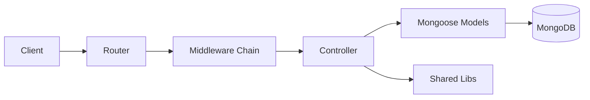

# 🧱 Architecture

## Layered Request Flow

The API follows a predictable request pipeline for consumers:

1. Request reaches a versioned API endpoint.
2. Authentication/authorization and validation checks are applied.
3. Business handler processes the request.
4. Data is read/written in MongoDB and a normalized response is returned.

## Consumer-Relevant Components

- **Auth layer:** verifies access token and enforces role restrictions.
- **Validation layer:** enforces payload and parameter rules before execution.
- **Business layer:** applies endpoint-specific behavior and returns response contracts.
- **Persistence layer:** stores users, blogs, comments, likes, and tokens.

## Security Pipeline (API View)

- Access token validation is applied on protected routes.
- Role checks enforce admin-only actions where required.
- Input validation runs before business handlers.
- Global protections include Helmet, CORS policy, and rate limiting.

## Upload And Media Flow (Blog Endpoints)

- Banner upload endpoints accept multipart form input.
- Uploaded media is stored in Cloudinary.
- Returned media metadata is persisted with the blog record.

## OpenAPI Workflow

- `docs/openapi.json` is the API contract source for docs/testing.
- `npm run generate:openapi` updates the contract file.
- Swagger UI serves the generated contract at `/api-docs`.


Use this page for architecture understanding, then navigate to the API-specific pages for request/response details.

