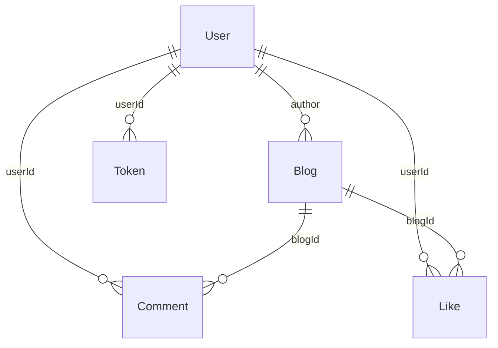

# 🔗 Entity relationship diagram (ERD)

Logical relationships between collections (Mongoose). Some links are plain ObjectIds without a `ref` in the schema but are still used by the application.

## 🧩 Relationships

- **Blog → User:** `Blog.author` references `User`.
- **Comment → User:** `Comment.userId` references `User`.
- **Comment → Blog:** `Comment.blogId` is an ObjectId (no `ref` in schema).
- **Like → User:** `Like.userId` references `User`.
- **Like → Blog:** `Like.blogId` is an ObjectId (no `ref` in schema).
- **Token → User:** `Token.userId` is an ObjectId (no `ref` in schema).
