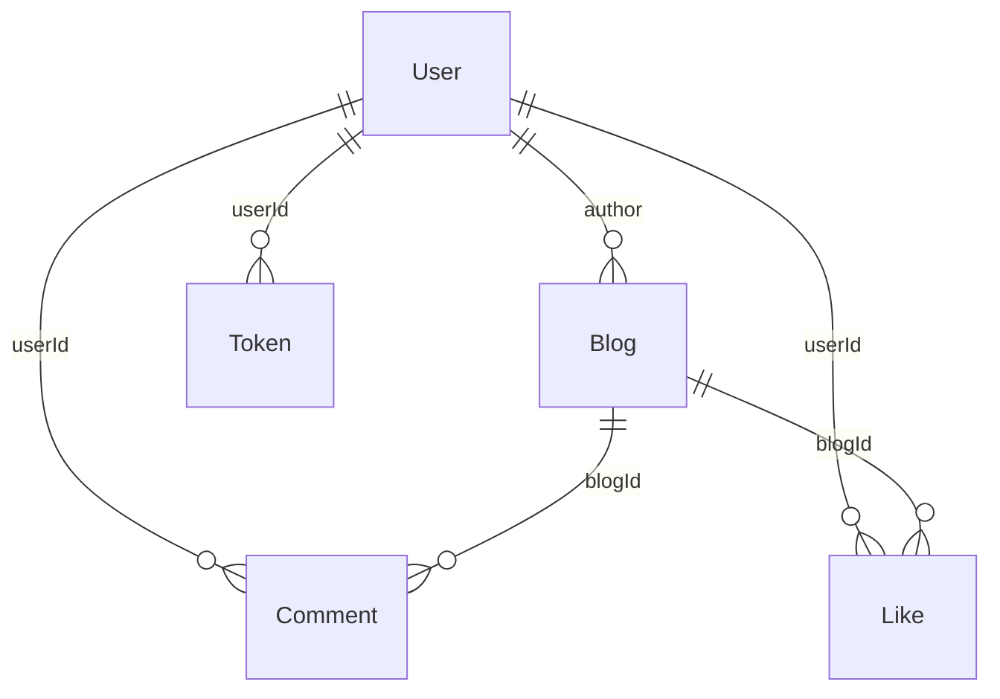

# Sơ đồ quan hệ (ERD)

Quan hệ logic giữa các collection (Mongoose). Một số liên kết chỉ là ObjectId không có `ref` trong schema nhưng vẫn được dùng trong ứng dụng.

- **Blog → User:** `Blog.author` ref `User`.
- **Comment → User:** `Comment.userId` ref `User`.
- **Comment → Blog:** `Comment.blogId` là ObjectId (không ref trong schema).
- **Like → User:** `Like.userId` ref `User`.
- **Like → Blog:** `Like.blogId` ObjectId (không ref trong schema).
- **Token → User:** `Token.userId` ObjectId (không ref trong schema).
